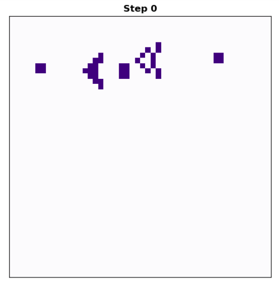
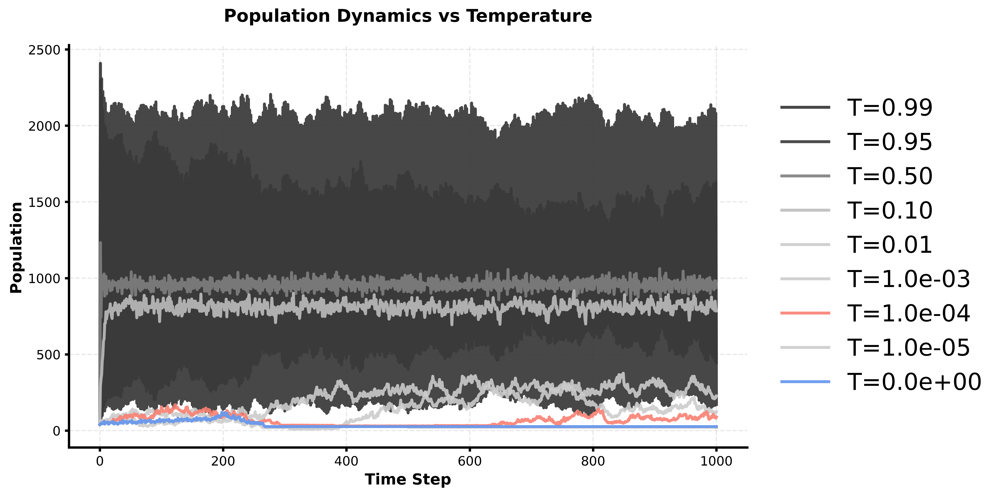
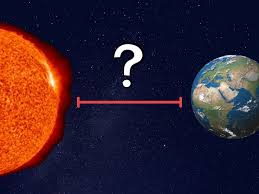

# Stochastic Game of Life: Finding the Goldilocks Zone

A JAX implementation of Conway's Game of Life with thermal fluctuations, revealing critical temperature dynamics at the edge of chaos.

## Motivation

I wanted to master JAX today, so I decided to learn it by implementing Conway's Game of Life with a twist: **What happens when we add thermal noise?**

## The Classic Game of Life

Conway's Game of Life is a cellular automaton where cells live or die based on their neighbors:
- **Survival:** A live cell with 2-3 neighbors stays alive
- **Birth:** A dead cell with exactly 3 neighbors becomes alive  
- **Death:** All other cells die

Starting from an initial configuration (here, the Gosper Glider Gun, discovered in 1970), the grid evolves deterministically according to these rules.

### The Problem: Getting Stuck

**Deterministic GoL gets stuck in local minima.** Even interesting patterns converge to boring, stable configurations after ~300 steps.

<p align="center">
  
  <br>
  <em>Initial pattern: Gosper Glider Gun (Step 0)</em>
</p>

<p align="center">
  
  <br>
  <em>T=0 (Deterministic): Converges to a static pattern after step 300</em>
</p>

## Adding Thermal Fluctuations

What if we add stochasticity—like thermal fluctuations in physics? We introduce a **temperature parameter** T that allows cells to randomly flip states with probability:

```
flip_probability = T × exp(-neighbors / 2)
```

Key insight: **Higher neighbor count = more stable = less likely to flip**

## The Goldilocks Zone: T=1E-4

Testing temperatures from T=0 to T=0.99 reveals a **critical temperature** where magic happens:

| Temperature | Behavior |
|-------------|----------|
| **T=0** | Deterministic—gets stuck ❌ |
| **T=1E-5** | Too little noise—still gets stuck ❌ |
| **T=1E-4** | **Goldilocks zone**—maintains dynamics! ✅ |
| **T>0.1** | Too much noise—random chaos ❌ |

<p align="center">
  
  <br>
  <em>T=1E-4: Pattern continues evolving indefinitely, never getting stuck!</em>
</p>

## Population Dynamics



The population time series reveals three regimes:

1. **Blue (T=0):** Crashes to ~50 cells and stays there (stuck in local minimum)
2. **Salmon (T=1E-4):** Fluctuates around ~100 cells indefinitely (Goldilocks zone!)
3. **Gray shades (T=0.01-0.99):** Explodes to chaotic high-density states (too much noise)

### 3×3 Temperature Grid Animation

<p align="center">
  
  <br>
  <em>All nine temperatures running in parallel—watch T=1E-4 (first row, third column) maintain interesting dynamics!</em>
</p>


## Why This Matters

This phenomenon appears throughout nature and computation:

### 🧬 Biology
- **DNA mutation rates** (~1E-9 per base): Enough to evolve, not enough to destroy
- **Protein folding**: Thermal energy helps escape misfolded states
- **Neural activity**: Brain operates between seizure (too active) and coma (too quiet)

### 🔬 Physics
- **Phase transitions**: Critical points between order and chaos
- **Self-organized criticality**: Systems naturally evolve toward T_critical
- **Edge of chaos**: Maximum computational capability

### 🤖 Machine Learning
- **Simulated annealing**: Cool from high T to critical T for optimization
- **Dropout/noise injection**: Prevents overfitting (avoids local minima)
- **Exploration vs exploitation**: Need just enough randomness

## The Key Discovery

**Complex adaptive systems thrive at the edge between order and chaos.**

- Too ordered → Frozen, stuck, dead
- Just right → Evolving, adaptive, alive  
- Too chaotic → Random, meaningless, soup

**T=1E-4 is the critical temperature where our cellular automaton is most "alive"** — continuously exploring new patterns while maintaining structure.

## Technical Implementation

Built entirely in JAX for:
- **JIT compilation** for speed
- **Functional RNG** with proper key splitting
- **Vectorized operations** on GPU/TPU
- **Pure functions** for reproducibility

Core stochastic update rule:
```python
@partial(jit, static_argnums=(2,))
def stochastic_game_of_life_step(grid, key, temperature=0.1):
    neighbors = count_neighbors(grid)
    deterministic_next = apply_gol_rules(grid, neighbors)
    
    # Thermal fluctuations
    stability = jnp.exp(-neighbors / 2.0)
    flip_probability = temperature * stability
    
    key, subkey = random.split(key)
    thermal_flip = random.uniform(subkey, grid.shape) < flip_probability
    noisy_state = jnp.where(thermal_flip, 1 - deterministic_next, deterministic_next)
    
    return noisy_state.astype(jnp.int32), key
```

## Repository Structure

```
├── stochastic_game_of_life.ipynb    # Main Jupyter notebook with all analysis
└── outputs/
    ├── V20251112_gosper_glider_gun_temp0_steps1000.gif
    ├── V20251112_gosper_glider_gun_temp1E-4_steps1000.gif
    └── V20251112_gosper_glider_gun_population_dynamics.png
```

## Running

Open `stochastic_game_of_life.ipynb` and run the cells! The notebook includes:
- Deterministic Game of Life implementation
- Stochastic version with temperature parameter
- Stability analysis and visualization
- Population dynamics across temperatures
- Animation generation

Key simulation code:
```python
from jax import random
import jax.numpy as jnp

# Run at critical temperature
key = random.PRNGKey(42)
grids, key = simulate_stochastic_pattern(grid, key, steps=1000, temperature=1e-4)

# Observe: Pattern never gets stuck!
```

## Conclusion

What started as a JAX learning exercise revealed a profound principle: **Life—whether biological, computational, or artificial—requires operating at a critical temperature** where order and chaos meet.

At T=1E-4, our Game of Life doesn't just simulate life—it exhibits a fundamental property of living systems: **perpetual exploration without losing structure.**

---

## The Goldilocks Principle

<p align="center">
  
</p>

Just as Earth sits at the perfect distance from the Sun—not too hot, not too cold—our cellular automaton thrives at T=1E-4, the critical temperature where complexity emerges. Too close to absolute zero (T=0) and the system freezes. Too hot (T>0.1) and it melts into chaos. 

**Life exists in the narrow band between order and disorder.** 🌍🌡️

---

*Built with JAX • Inspired by Conway • Driven by curiosity about the edge of chaos* 🌊🔥


